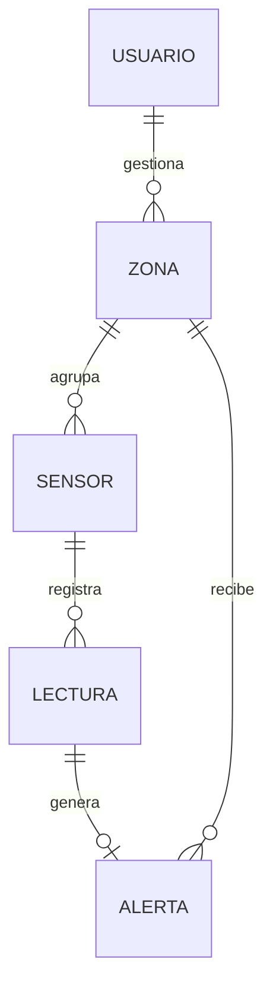

<div align="center">

# 💧 HidroMon API

**Sistema de Monitoreo de Humedad IoT**

API REST que gestiona usuarios, sensores, zonas de cultivo, lecturas de humedad y alertas
para el proyecto HidroMon.


</div>

---

## 📌 ¿Qué es HidroMon?

HidroMon es una plataforma que recolecta y gestiona datos de **humedad de suelo** y
**humedad ambiental** que envían sensores IoT instalados en los cultivos. Con esos datos,
agricultores y administradores pueden:

- 📡 **Recolectar** mediciones de los sensores de cada zona.
- 📊 **Monitorear** en tiempo real los niveles de humedad.
- 🎯 **Definir umbrales** mínimos y máximos para cada cultivo o zona.
- 🚨 **Recibir alertas** cuando una lectura se sale del rango.

Este repositorio contiene el **backend**. Está hecho en NestJS con el mismo patrón que vimos
en la práctica 3 de *Framework WEB*: modelo, DTO, controlador y servicio, con los datos
guardados en memoria.

## 🧩 Entidades



| Entidad | Campos | Qué representa |
|---|---|---|
| **Usuario** | `nombre`, `email`, `rol`, `nickname` | Agricultor o administrador que consulta el sistema |
| **Sensor** | `codigo`, `tipo`, `zonaId` | Dispositivo IoT de humedad de `Suelo` o `Ambiental` |
| **Zona** | `nombre`, `cultivo`, `humedadMin`, `humedadMax` | Área de cultivo con sus umbrales |
| **Lectura** | `sensorId`, `valor`, `fecha` | Una medición tomada por un sensor |
| **Alerta** | `lecturaId`, `zonaId`, `nivel`, `mensaje` | Aviso de que una lectura quedó por encima (`Alta`) o por debajo (`Baja`) del rango |

Todos los registros tienen además `id` e `isActive`.

## 🛣️ Endpoints

Base: `http://localhost:3000`

Los cinco recursos comparten las mismas rutas:

| Método | Ruta | Descripción |
|---|---|---|
| `GET` | `/{recurso}` | Lista los registros activos |
| `GET` | `/{recurso}/id/:id` | Busca uno por su id |
| `POST` | `/{recurso}` | Crea un registro |
| `PUT` | `/{recurso}/:id` | Actualiza un registro |
| `DELETE` | `/{recurso}/:id` | Elimina un registro |

Y cada uno trae una búsqueda propia:

| Recurso | Búsqueda | Ejemplo |
|---|---|---|
| `usuarios` | `GET /usuarios/nombre/:nombre` → devuelve el correo | `/usuarios/nombre/Diego Pinta` |
| `sensores` | `GET /sensores/tipo/:tipo` | `/sensores/tipo/Suelo` |
| `zonas` | `GET /zonas/cultivo/:cultivo` | `/zonas/cultivo/Papa` |
| `lecturas` | `GET /lecturas/sensor/:sensorId` | `/lecturas/sensor/1` |
| `alertas` | `GET /alertas/nivel/:nivel` | `/alertas/nivel/Alta` |

### Ejemplos

**Crear una zona**

```bash
curl -X POST http://localhost:3000/zonas \
  -H "Content-Type: application/json" \
  -d '{"nombre":"Lote Nuevo","cultivo":"Papa","humedadMin":60,"humedadMax":80}'
```

```json
{ "nombre": "Lote Nuevo", "cultivo": "Papa", "humedadMin": 60, "humedadMax": 80, "id": "1791417181597", "isActive": true }
```

**Actualizar una lectura**

```bash
curl -X PUT http://localhost:3000/lecturas/1 \
  -H "Content-Type: application/json" \
  -d '{"sensorId":"1","valor":75,"fecha":"2026-10-07 08:00"}'
```

```json
{ "msg": "Lectura actualizada correctamente", "data": { "id": "1", "sensorId": "1", "valor": 75, "fecha": "2026-10-07 08:00", "isActive": true } }
```

**Buscar algo que no existe**

```json
{ "message": "Sensor con ID 99 no existe", "error": "Not Found", "statusCode": 404 }
```

## 🚀 Cómo ejecutarlo

Necesitas **Node.js 24** o superior.

```bash
git clone https://github.com/diarpicu2022-commits/hidromon-nestjs.git
cd hidromon-nestjs
npm install
npm run start:dev
```

La API queda en `http://localhost:3000`. Para usar otro puerto: `PORT=4000 npm run start:dev`.

| Comando | Para qué |
|---|---|
| `npm run start:dev` | Desarrollo, se recarga sola al guardar |
| `npm run build` | Compila a `dist/` |
| `npm run start:prod` | Ejecuta lo compilado |
| `npm run test` | Pruebas unitarias |

## 📁 Estructura

```
src/
├── main.ts
├── app.module.ts          # registra los controladores y servicios
├── usuarios/
│   ├── usuario.model.ts   # interfaz del recurso
│   ├── usuario.dto.ts     # DTO de creación y edición con class-validator
│   ├── usuarios.controller.ts
│   ├── usuarios.service.ts
│   └── *.spec.ts          # pruebas
├── sensores/              # misma estructura
├── zonas/
├── lecturas/
└── alertas/
```

## ⚠️ Limitaciones conocidas

- Los datos viven **en memoria**: al reiniciar el servidor vuelven los 15 registros iniciales de cada recurso.
- Los DTO tienen validaciones, pero todavía no se aplican porque `main.ts` no activa el `ValidationPipe`.
- `npm run test` no arranca con la configuración actual: NestJS 12 se distribuye como ES Module y el Jest de la plantilla no lo carga. Le pasa igual a la plantilla de la práctica.

## 👥 Equipo

| Integrante | Programa |
|---|---|
| **Diego Armando Pinta Cuasquen** | Ingeniería Electrónica e Ingeniería de Software |
| **Leider Fabian Chipu Erazo** | Ingeniería de Software |
| **Juan José Rueda** | Ingeniería de Software |

<div align="center">

Proyecto académico · *Framework WEB* (Electiva 2) · 5.º semestre

</div>
